# The Steakery - Bake by Day, Steak by Night: Django-Based Steakhouse & Bakery Website

## Project Overview 

**The Steakery** is a web application that serves as the online presence for a fictional steakhouse and bakery located in Dublin. This project combines an interactive frontend with a backend built using Django, allowing customers to explore the restaurant's offerings, make reservations, and manage bookings directly through the website.

[View The Steakery live website here](https://thesteakerypp4-443f2b4046b5.herokuapp.com/)

### Project Goals

The main goal of *The Steakery* project is to provide a seamless online experience where users can view the restaurant's offerings and book a table effortlessly. The project is aimed at offering an intuitive and visually appealing platform, focusing on user experience.

### Agile Methodology

Agile was used to organise and prioritise tasks, into ToDo, In Progress, Done & Won't have.
* User stories were created to illustrate what the project must be included, should be included and couldn't be included.
* The Board is set to public
* The Board was used to track progress on the project.

### User Stories Template

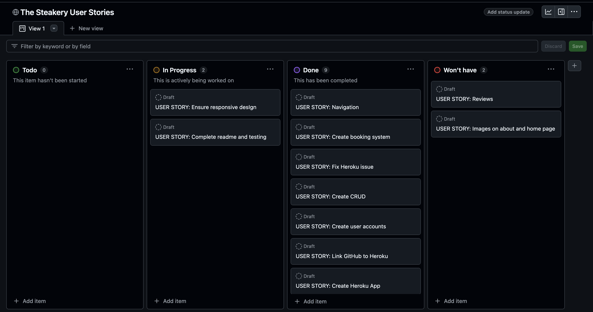

Please see the following link for the [project board](https://github.com/users/micdr93/projects/2)

### Target Audience

* People in Dublin who either want to grab a coffee and baked goods, or enjoy the steakhouse in the evening.
* Users who want to be able to book, edit, view or delet their reservations.
* Users who want to be able to add special requests, like wheelchair access, and to also select a table with guest capacity.

### First time user
* Users are met with a clean and straight forward homepage, with simple navigation.
* Users can log in or sign up, in order to make bookings.
* Users can view the menu of what the Steakery has to offer.

### Registered User
* Login process is simple.
* Registered users can create, view, edit or delete their bookings.

### Admin user

* Solid Django login portal for site admins.
* Access for admins to manage users, bookings, and tables.
* Admins can add more tables to facilitate more patrons.

### Design

* The Steakery features a clean white and red colour scheme and custom logo, which I created using Adobe Express.
* The logo sits on the navigation bar, ensuring consistent design scheme throughout the site.

### Logo 
* I created the logo myself using Adobe Express.

### Typography 
* Poppins and Serif fonts were used throughout the site, Bebas Neue was considered initially.

### Wireframes 

- Booking

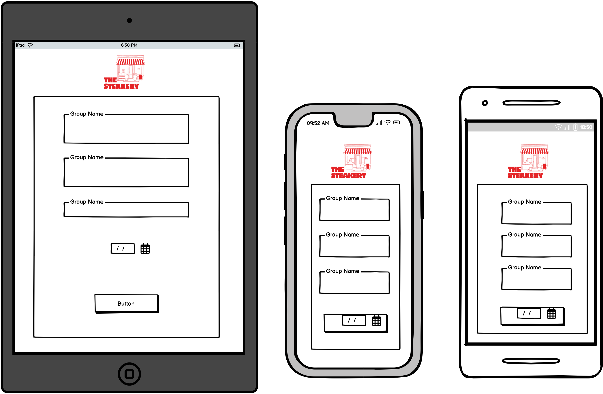

- Home Page

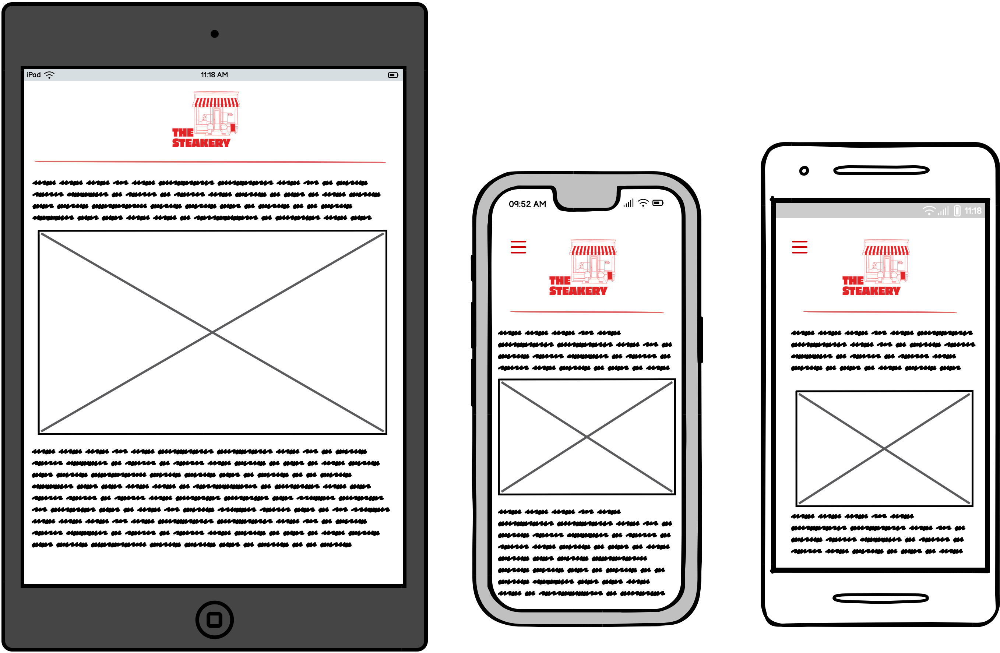

### Data Models for The Steakery

1. **User Model (Django AllAuth)**
    * Django AllAuth handles user authentication and registration. It provides a default user model to manage customer information.
    * A user can have multiple bookings (one-to-many relationship). Each booking is associated with a single user.

---

2. **SpecialRequest Model**
    * The `SpecialRequest` model allows users to include special requests with their table reservations (e.g., vegetarian meals, wheelchair access).
    * Admins can add or update special requests through the Django admin panel.
    * This model has a many-to-many relationship with the `Booking` model, meaning users can associate multiple special requests with a booking.

---

3. **Table Model**
    * The `Table` model represents a table in the restaurant that guests can reserve.
    * Each table has a unique `table_number` and a `max_capacity`, indicating the number of guests the table can accommodate.
    * The model ensures that tables are uniquely identified and helps manage available seating.

---

4. **Booking Model**
    * The `Booking` model stores information related to a table reservation made by a user. This includes the user, table, date, time, and number of guests.
    * The model ensures that:
        * Reservation dates and times are in the future.
        * The number of guests does not exceed the table’s maximum capacity.
        * Special requests (optional) can be linked to each booking.
    * Admins can manage bookings through the Django admin panel, and users can create, edit, or delete their bookings directly from the platform.

### Database Scheme

Entity Relationship Diagram (ERD)

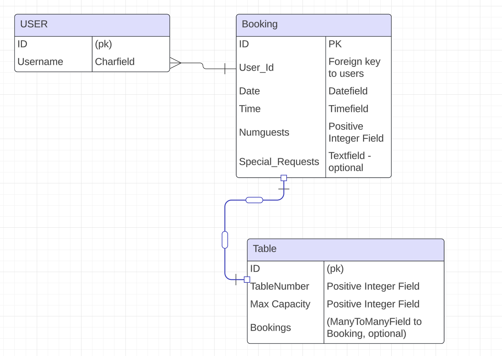

* The **SpecialRequest** entity represents any special requests that can be associated with table reservations (e.g., vegetarian, wheelchair access). It contains the `id` as the primary key and the `name` field to describe the request.
* The **Table** entity represents individual tables in the restaurant, with fields including `id` as the primary key, `table_number` to uniquely identify each table, and `max_capacity` to specify how many guests the table can accommodate.
* The **Booking** entity represents a reservation made by a user for a specific table. It includes `id` as the primary key, `table_id` as a foreign key referencing the Table entity, `user_id` as a foreign key referencing the User entity, `date` for the reservation date, `time` for the reservation time, and `num_guests` for the number of guests in the booking. Special requests can also be linked through a many-to-many relationship.

This schema efficiently manages users, tables, and reservations. Users can make reservations for specific tables, and each booking includes relevant details such as the date, time, number of guests, and any special requests.

## Security Features 

### User Authentication

* Django's built-in authentication system is used for managing user registration, login, and account management. It ensures that only authenticated users can access specific features, like managing bookings.

### Login Decorator

* Views such as `create_booking`, `update_booking`, `delete_booking`, and `booking_list` use Django’s `login_required` decorator to restrict access to authenticated users only.
* This ensures that only logged-in users can create, modify, or view their reservations.

### CSRF Protection

* Django provides built-in protection against Cross-Site Request Forgery (CSRF) attacks. CSRF tokens are automatically generated for each user session and included in forms to prevent unauthorized state-changing actions.
* When a user logs out, the session and the associated CSRF token are invalidated, making it harder for attackers to perform malicious actions via forged requests.

### Form Validation

* The `create_booking` and `update_booking` views validate form inputs using Django’s `BookingForm` class.
* It checks for multiple conditions, such as ensuring the reservation dates are valid, the number of guests is within table capacity, and that required fields are filled correctly.

### Overlapping Booking Prevention

* The system ensures there are no double bookings by checking for existing reservations for the same table on the selected date and time.
* If an overlapping booking is found, an error message is displayed, preventing users from booking the same table at the same time.

## Existing Features
* Home Page
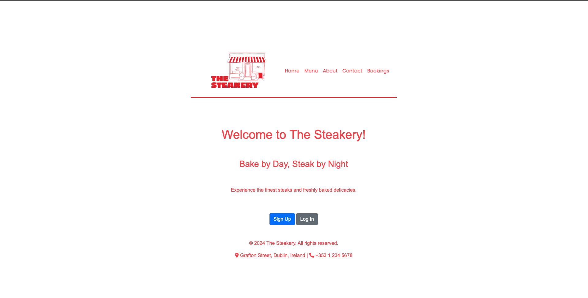
* About
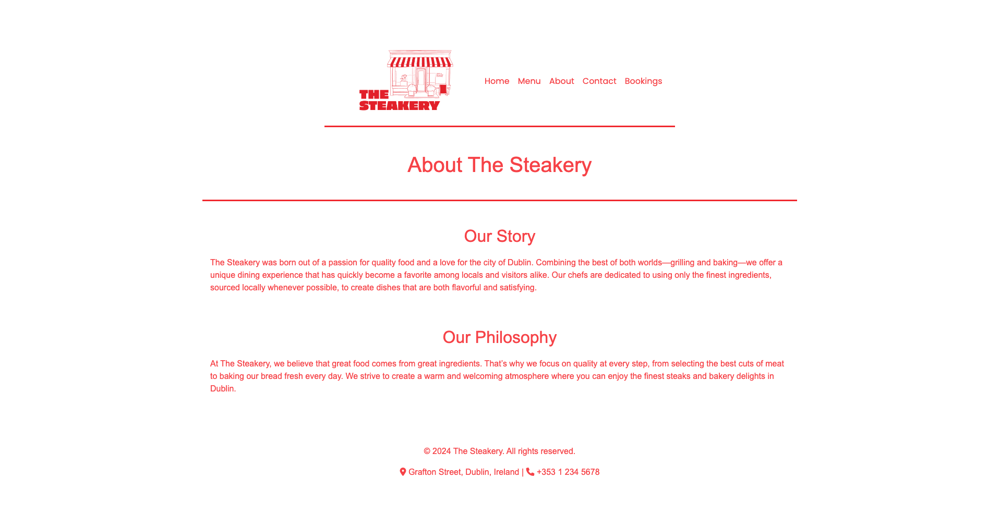
* Menu
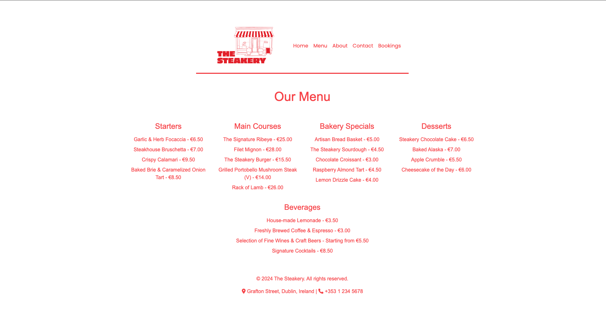
* Contact
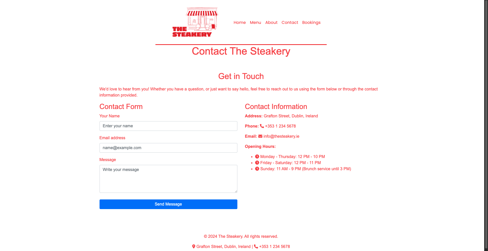
* Create Booking
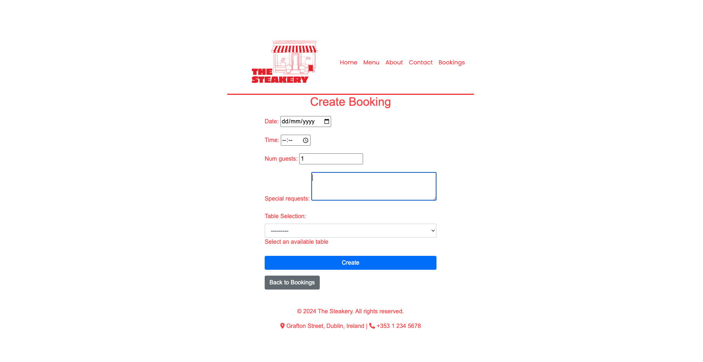
* Delete Booking
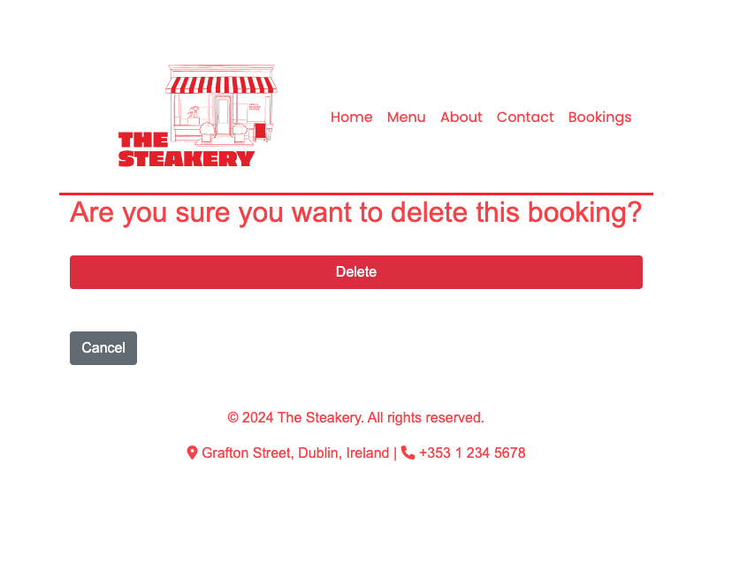
* Edit Booking
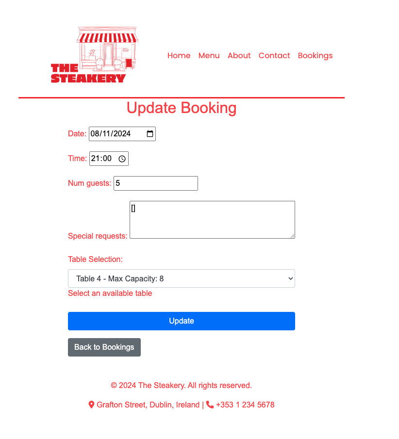
* Existing Bookings
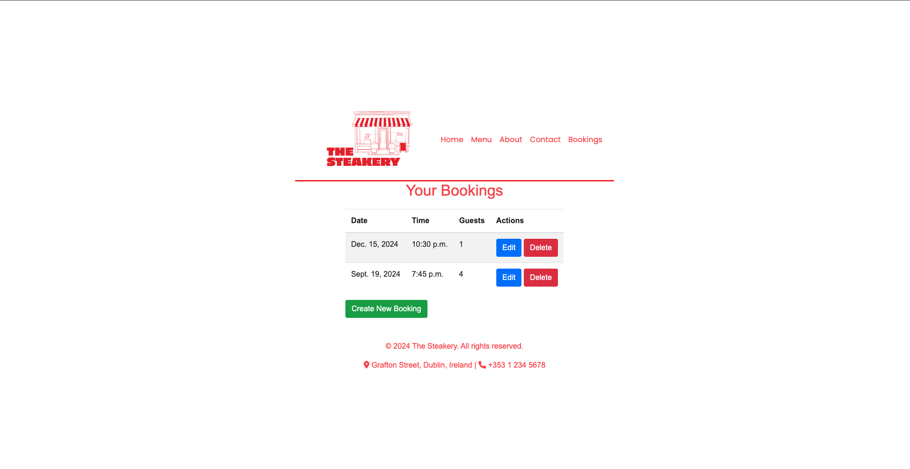
* Table Selection
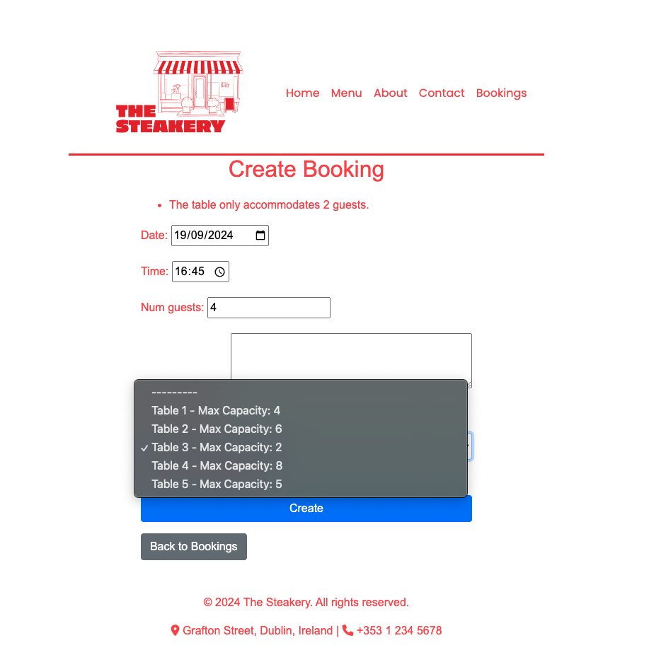
* Booking Login
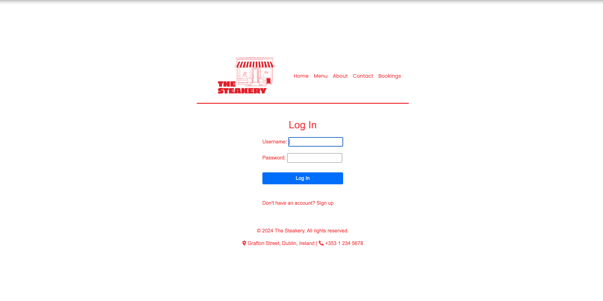
* Booking Login 2
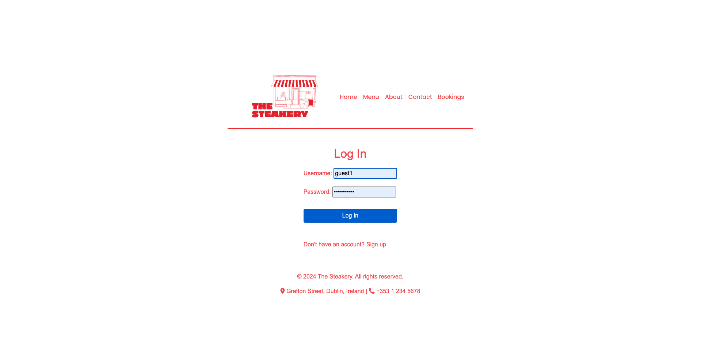

### Admin Features

* Django's built-in admin panel provides full control over the website's data and content.
* Admins can access the admin panel through the navigation bar.
* Admin capabilities include adding, updating, and deleting table reservations and managing restaurant tables.
* Admins can create and manage special requests (e.g., dietary preferences, accessibility needs) linked to bookings.
* Admins can also manage user accounts, delete user data, and view or delete bookings.

## Technologies Used

### Languages Used

* [HTML5](https://en.wikipedia.org/wiki/HTML5)
* [CSS3](https://en.wikipedia.org/wiki/CSS)
* [JavaScript](https://en.wikipedia.org/wiki/JavaScript)
* [Python](https://en.wikipedia.org/wiki/Python_(programming_language))

### Databases Used
* [Postgresql](https://www.postgresql.org/)

### Frameworks Used

* [Django](https://www.djangoproject.com/) - Python framework

### Programs Used

* [GitHub](https://github.com/) - Used for storing the project code online and version control.
* [GitPod](https://www.gitpod.io/) - Cloud-based IDE used to write and develop the code.
* [Heroku](https://www.heroku.com/) - Used to deploy the site as a cloud-based platform.
* [Google Fonts](https://fonts.google.com/) - Used to import the main fonts for the website.
* [Balsamiq](https://balsamiq.com/wireframes/) - Utilized to create wireframes during the planning phase.
* [Lucid Chart](https://lucidchart.com/) - Used to create the Entity Relationship Diagram (ERD).
* [Am I Responsive](https://ui.dev/amiresponsive) - Tool to display how the website appears on different device sizes.
* [Git](https://git-scm.com/) - Version control system used to track changes in the codebase.
* [JSHint](https://jshint.com/) - Used for JavaScript code validation.
* [W3C Markup Validation Service](https://validator.w3.org/) - Used for validating HTML for syntax correctness.
* [CSS Validation Service](https://jigsaw.w3.org/css-validator/) - Used to validate CSS for any errors or warnings.
* [CI Python Linter](https://pep8ci.herokuapp.com/#) - Used to validate Python code for PEP8 compliance.

## Deployment and Local Developement

Live deployment can be found here [The Steakery](https://thesteakerypp4-443f2b4046b5.herokuapp.com/)

### Local Deployment

#### How to Fork
1. Log in(or Sign Up) to Github
2. Go to repository for this project (https://github.com/micdr93/TheSteakeryPP4)
3. Click the fork button in the top right corner

#### How to Clone
1. Log in(or Sign Up) to Github
2. Go to repository for this project [The Steakery](https://github.com/micdr93/TheSteakeryPP4)
3. Click on the code button, select whether you would like to clone with HTTPS, SSH or GitHub CLI and copy the link shown.
4. Open the terminal in your code editor and change the current working directory to the location you want to use for the cloned directory.
5. Type the following command in the terminal (after the git clone you will need to paste the link you copied in step 3 above)
6. Set up a virtual environment (this step is not required if you are using the Code Institute Template in GitPod as this will already be set up for you).
7. Install the packages from the requirements.txt file - run Command pip3 install -r requirements.txt

### Heroku Deployment

1. Log into your [Heroku](https://www.heroku.com/) account or create an account if you don't already have one.
2. Click the "New" button at the top right corner and select "Create New App".
3. Enter a unique application name for your app.
4. Select your region.
5. Click "Create App".

#### Prepare environment and settings.py

1. In your local development environment (e.g., GitPod), create an `env.py` file in the root directory.
2. Add the `DATABASE_URL` and your chosen `SECRET_KEY` to the `env.py` file.
3. In your `settings.py`, import the `env.py` file and add the paths for the `SECRET_KEY` and `DATABASE_URL`.
4. Comment out the default SQLite database configuration.
5. Save all files and run migrations to update your database.
6. Update the `STATIC` files settings:
   - Set the URL, storage path, directory path, root path, media URL, and default file storage path for your static and media files.
7. Link the `TEMPLATES_DIR` to the templates directory in Heroku.
8. Add the Heroku app to the `ALLOWED_HOSTS` list in the format: `['your-app-name.herokuapp.com']`.

#### Add the following Config Vars in Heroku:

1. `SECRET_KEY` - Use a Django-generated secret key.
2. `PORT = 8000`
3. `DISABLE_COLLECTSTATIC = 1` - This is temporary and should be removed before final deployment.
4. `DATABASE_URL` - Use the PostgreSQL database URL provided by Heroku's built-in Postgres add-on.

#### Setting up PostgreSQL on Heroku:

1. In the "Resources" tab on your Heroku app dashboard, search for "Heroku Postgres".
2. Once the database is attached, the `DATABASE_URL` will automatically be set in your Heroku config vars.

#### Additional Files Needed for Heroku Deployment:

1. `requirements.txt` - A list of required packages for the project.
2. `Procfile` - Used to specify the commands that are run by Heroku's dynos.

Once these steps are complete, the site should be ready for deployment on Heroku with PostgreSQL.

## Testing

Thorough testing was conducted throughout the development of **The Steakery** to ensure the functionality, usability, and responsiveness of the website across different platforms and devices. The following is a summary of the testing procedures and results:

### Manual Testing

#### 1. **Navigation Bar**
   - **Test**: Ensure that all navigation links work as expected.
   - **Result**: All links navigate to the correct pages (Home, Menu, About, Contact, Bookings).
   - **Devices Tested**: Desktop, Mobile, Tablet.
   - **Browsers Tested**: Chrome, Firefox, Safari.

#### 2. **User Registration & Authentication**
   - **Test**: Users should be able to register, log in, and log out successfully.
   - **Result**: 
     - Registration form properly validates inputs.
     - Users are redirected to the home page after registration or login.
     - Logout functionality works as expected.
   - **Browsers Tested**: Chrome, Firefox, Safari.

#### 3. **Booking Creation**
   - **Test**: Users should be able to create a booking.
   - **Result**: The booking form works, data is saved correctly, and the booking appears in the user’s booking list.
   - **Special Test**: Ensured that the booking date cannot be in the past.
   - **Edge Cases**: Tested with various table capacities to ensure users can't book for more guests than a table can accommodate.

#### 4. **Booking List and Edit/Delete**
   - **Test**: Users should see their bookings and be able to edit or delete them.
   - **Result**: Bookings are displayed in a list with options to edit or delete. Both actions function as expected.
   - **Edge Cases**: Ensured users cannot book overlapping times for the same table.

#### 5. **Form Validation**
   - **Test**: Ensure form validation is functioning properly.
   - **Result**: Forms display appropriate error messages for invalid inputs (e.g., missing required fields, invalid email format, past dates for bookings).
   - **Browsers Tested**: Chrome, Firefox.

#### 6. **Responsiveness**
   - **Test**: Ensure the website is responsive across all device types.
   - **Result**: The layout adjusts properly on mobile devices, tablets, and desktops.
   - **Tools Used**: Chrome DevTools, Responsinator.

### Automated Testing

#### 1. **Django Unit Tests**
   - **Test**: Models and views have been tested using Django's built-in test framework.
   - **Result**: All unit tests pass, ensuring that the models (User, Booking, Table) and views function as expected.

#### 2. **W3C HTML Validator**
   - **Test**: Ensure HTML validation passes without significant issues.
   - **Result**: Minor warnings resolved, no critical errors found.

#### 3. **CSS Validation**
   - **Test**: CSS was validated using the [W3C CSS Validation Service](https://jigsaw.w3.org/css-validator/).
   - **Result**: No significant errors found.

#### 4. **JavaScript Validation**
   - **Test**: JavaScript was validated using JSHint.
   - **Result**: JavaScript passed validation with no critical issues.

### Issues Discovered and Fixed

- **Booking form allowing past dates**: Implemented validation to prevent past dates from being booked.
- **Overlapping bookings**: Added logic to check for table availability and prevent double booking for the same time and table.
- **Broken links in the navigation bar**: Identified and fixed paths for several internal links.
- **CSS rendering issues in production**: Ensured that the static files are correctly handled in the production environment by adjusting `STATIC_URL` and `STATIC_ROOT` settings in `settings.py`.

### Lighthouse Testing

Lighthouse, a popular open-source tool for auditing web performance, accessibility, SEO, and best practices, was used to evaluate **The Steakery**.

#### Key Metrics Assessed:
1. **Performance**: Evaluated the website's loading time and overall speed.
2. **Accessibility**: Tested for screen reader compatibility and ease of navigation for users with disabilities.
3. **SEO**: Ensured that the website follows best practices for search engine optimization.
4. **Best Practices**: Assessed compliance with web development best practices, including security and performance optimizations.

#### Results:
- **Performance**: Scored between 85-90, depending on network speed.
- **Accessibility**: Scored a strong 95, with minor recommendations for improving alt text descriptions and contrast.
- **SEO**: Scored 100, ensuring that metadata, structured data, and crawlability are optimal.
- **Best Practices**: Scored 100, ensuring no critical security or performance issues.

Recommendations provided by Lighthouse (such as image optimizations and lazy loading) were addressed where possible to further improve performance and accessibility.

### CI Python Linter

The project was also checked using the **Code Institute Python Linter** to ensure adherence to PEP8 standards and best practices in Python coding.

#### Results:
- No critical issues were found during the Python code validation.
- Minor suggestions for improvements were addressed, such as the addition of docstrings to functions and ensuring proper indentation.
- The code is fully compliant with PEP8 standards, ensuring readability, maintainability, and reduced likelihood of bugs.

### Testing Summary

All critical functions were tested, and issues were addressed during the development process. The site performs well across devices and browsers, with form validation and responsive design functioning as expected. Where possible, edge cases were tested to ensure robustness and usability.

# References

### Docs

* [Stack Overflow](https://stackoverflow.com/)
* [Code Institute](https://learn.codeinstitute.net/dashboard)
* [Bootstrap 4.6](https://getbootstrap.com/docs/4.6/getting-started/introduction/)
* [Django docs](https://docs.djangoproject.com/en/4.2/releases/3.2/)
* [Django Allauth](https://django-allauth.readthedocs.io/en/latest/)
* [Django and Static Assets](https://devcenter.heroku.com/articles/django-assets)
* [Google](https://www.google.com/)
* [W3 Schools](https://www.w3schools.com/)

### Code & Content 
* Code from [Oasis Hotels](https://github.com/Marchopkins96/oasis-hotels/tree/main) was used and modified for this project.
* Images were created using Adobe Express

### Acknowledgements

* I would like to thank my mentor Dan Hamilton, for the continued support and feedback on the project. 
* I would also like to express my gratitude to my nephew Daniel for his valuable contributions to the development of The Steakery concept. 
* I would like to thank Code Institute community and team for their help whenever needed.

### Note to Assessor

Please be aware that this project was completed under significant time pressure, as I had previously deleted the original repository by mistake. This has been an important learning experience for me, particularly in avoiding the creation of multiple repositories with similar names, which contributed to the error. While I have worked hard to rebuild the project as quickly as possible, there may be areas that would have benefited from more attention and refinement. I appreciate your understanding as I continue to learn and grow from this experience.
